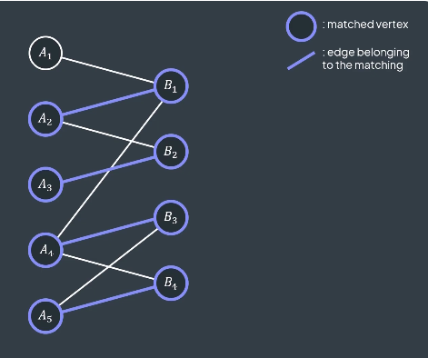
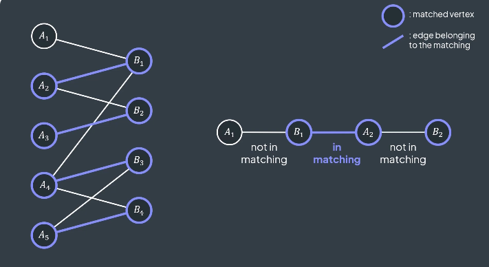
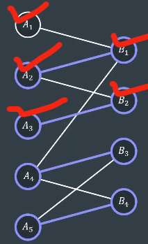
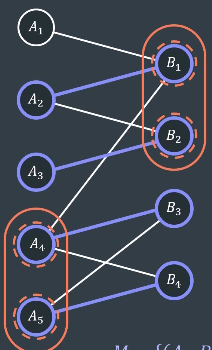

# Vertex Cover:
<br>

**A vertex cover in a graph is a set of vertices that includes at least one endpoint of every edge.**


In the given graph, consider the vertex set **V_c = {1, 2, 3, 4}**. This set qualifies as a vertex cover because every edge in the graph has at least one endpoint within **V_c**. 
<br>


<br>

Similarly, the sets **V_c = \{1, 2, 4, 5\}**, **V_c = \{2, 3, 5\}** and **V_c = \{1, 2, 3, 4, 5\}** also serve as valid vertex covers.
<br>

 

<br>

But **V_c = \{1, 2, 5\}** is **not** a vertex cover, because as we can see below, there is an edge which is not covered.

<br>


<br> 
<br>
<br>

**Finding any vertex cover set is a simple task because the set of all vertices always serves as a vertex cover surely. However, the real challenge lies in finding the minimum vertex cover.**

<br>

## Minimum Vertex Cover:
<br>

**A vertex cover is minimum if no other vertex cover has fewer vertices. Number of vertices in the minimum vertex cover set is lowest among all the vertex cover sets**

<br>

For example in the graph, **V_c = \{2, 3, 5\}** is a minimum vertex cover.


<br>


---


# Independent Set:
<br>

**An independent set in a graph is a set of vertices such that no edge in the graph connects any pair of vertices in the independent set.**


For example in the graph, vertex set **I = {1, 4}** or **I = {1, 3}** is an independent set. Because no edge in the graph connects any pair of vertices in the independent set **I**. 

<br>

 


But **Set {1, 4, 5} or {1, 2, 3}** is not an independent set. As we can see, two edges connect the pair of vertices (4, 5) and (1, 5) which are in **{1, 4, 5}** and two edges connects the pairs of vertices (1, 2) and (2, 3) which are in **{1, 2, 3}**.

 


<br>
<br>
<br>

**Finding any independent set is very easy, as any single vertex set can serve as an independent set. example I = {1} or I = {2} ..**
<br>
**But the real challenge lies in finding the maximum independent set.**

<br>
<br>

## Maximum Independent Set:
<br>

**An independent set is maximum if no other independent set contains more vertices.**
<br>
For example in the above graph **I = {1, 4}** is a maximum independent set. or **I = {1, 3}**. 

<br>
<br>

**Example for an bipartite graph:**
<br>


The **left** vertices set or **right** vertices set can be considered an **independent set**. But maximum independent set could be different. 
<br>


These independent set contains **3** vertices, But below the Maximum Independent set contains **4** vertices......
<br>


---

# The minimum vertex cover is the exact opposite of the maximum independent set:
<br>

**In a graph, the vertices in the maximum independent set are precisely those not included in the minimum vertex cover, and vice versa.**

<br>

For example minimum vertex cover **V_c = {2, 3, 5}** and maximum independent set **I = {1, 4}**. <br>
They are excatly opposite/complement of each other, ie. **I = {V - V_c} or V_c = {V - I}**.


  


<br>
<br>

**For a graph, if we find the minimum vertex cover, we can also determine the maximum independent set by simply taking the complement of the minimum vertex cover.**


<br>
<br>

**However, finding the minimum vertex cover or the maximum independent set for any graph is an NP-hard problem.**

<br>

**However, things become interesting when we consider a bipartite graph.**

<br>

---

# Kőnig's theorem: In any bipartite graph, the number of edges in a maximum matching |M|, equals the number of vertices in a minimum vertex cover |V_c|.

<br>
For proof check the example section of : https://en.wikipedia.org/wiki/K%C5%91nig%27s_theorem_(graph_theory)#Example
<br>


---

<br>

# Find Minimum Vertex Cover in a Bipartite Graph Algorithm:
<br>

1. **Find the Maximum Matching**:
   - Use an algorithm like the **Hopcroft-Karp algorithm** or the **Edmonds-Karp algorithm** to find the maximum matching in the bipartite graph. This will give you the set of edges that form the matching. For contest use **Hopcroft-Karp algorithm**, as it is **O(E*√V)**.
<br>

<br>

2. **Construct the Alternating Forest ( (left)--unmatching_edge--(right)--matching_edge--(left)--unmatching_edge--(right)--..**:
   - Start with all unmatched vertices in the **Left** set of the bipartite graph. For example in the graph below, **A1** is not an endpoint of a matching edge.
   <br>
   
   <br>
   
   - Perform a BFS or DFS to explore alternating paths starting from the unmatched vertices in **Left**. Alternate between edges that are not part of the matching and edges that are part of the matching.
   - Mark all vertices visited during this exploration.
   - For the graph above, this traversing would look like:
   - (A1)-----(B1)**------**(A2)------(B2)**--------**(A3)

<br>

3. **Mark Vertices**:
   - After the BFS/DFS, mark all vertices in **Left** that are reachable starting from an unmatched vertex in **Left** via alternating paths (using unmatched---matched edges--unmatched edges.... exploration).
   - Also, mark all vertices in **Right** that are connected to the marked vertices in **Left** by a matching edge.
   <br>
   
   <br>

4. **Identify the Minimum Vertex Cover**:
   - The minimum vertex cover will consist of:
     - All unmarked vertices in **Left** (since they are not reachable by alternating paths).
     - All marked vertices in **Right** (since they are connected to unmarked vertices in **Left** by a matching edge).
   <br>
   
   <br>

5. **Output the Minimum Vertex Cover**:
   - The set of vertices identified in the previous step forms the minimum vertex cover.
   For the above graph, it is **V_c = {A4, A5, B1, B2}.**

<br>
For proof of this algorithm check this out: https://www.youtube.com/watch?v=K-g5AzHACWs
<br>

---
**For some sort of understanding:** It is clear that exactly **one endpoint** of each **matching edge** must be in the minimum vertex cover. If not consider a matching edge from left to right (a)----------(b). If neither vertex (a) nor (b) is in the vertex cover, then the edge (a)--------(b) will not be covered. Therefore, either vertex (a) or vertex (b) must be included in the minimum vertex cover, but not both, as we are looking for a minimum cover. The question then arises: how do we decide which one to include? This is done by using an alternating edge traversal.

---
**The minimum vertex cover consist of:**
 - All unmarked vertices in **Left**. (If an unmarked vertex in Left were excluded from the vertex cover, it would leave the matching edge connected to this vertex uncovered, violating the definition of a vertex cover.)

 - All marked vertices in **Right** (If a marked vertex in Right were excluded from the vertex cover, the edge between that vertex and the unmarked vertex in Left would remain uncovered.)
---

# Code: 

```cpp	
const int N = 3e5 + 9;

struct HopcroftKarp
{
        int left_size, right_size;
        vector<int> left_i_is_connected_to_right;
        vector<int> right_i_is_connected_to_left;
        vector<int> level;
        vector<vector<int>> graph;

        HopcroftKarp(int _n, int _m)
        {
                left_size = _n;
                right_size = _m;
                int p = _n + _m + 1;
                graph.resize(p);
                left_i_is_connected_to_right.resize(p, 0);
                right_i_is_connected_to_left.resize(p, 0);
                level.resize(p, 0);
        }

        void addEdge(int u, int v)
        {
                graph[u].push_back(v + left_size); // right vertex is increased by left_size here..
        }

        bool bfs()
        {
                queue<int> q;

                for (int u = 1; u <= left_size; u++)
                {
                        if (!left_i_is_connected_to_right[u])
                        {
                                level[u] = 0;
                                q.push(u);
                        }
                        else
                        {
                                level[u] = inf;
                        }
                }

                level[0] = inf;

                while (!q.empty())
                {
                        int u = q.front();
                        q.pop();

                        for (auto v : graph[u])
                        {
                                if (level[right_i_is_connected_to_left[v]] == inf)
                                {
                                        level[right_i_is_connected_to_left[v]] = level[u] + 1;
                                        q.push(right_i_is_connected_to_left[v]);
                                }
                        }
                }

                return level[0] != inf;
        }

        bool dfs(int u)
        {
                if (!u)
                {
                        return true;
                }

                for (auto v : graph[u])
                {
                        if (level[right_i_is_connected_to_left[v]] == level[u] + 1 && dfs(right_i_is_connected_to_left[v]))
                        {
                                left_i_is_connected_to_right[u] = v;
                                right_i_is_connected_to_left[v] = u;
                                return true;
                        }
                }

                level[u] = inf;

                return false;
        }

        int MaximumBipartiteMatching()
        {
                int ans = 0;

                while (bfs())
                {
                        for (int u = 1; u <= left_size; u++)
                        {
                                if (!left_i_is_connected_to_right[u] && dfs(u))
                                {
                                        ans++;
                                }
                        }
                }

                return ans;
        }

        vector<pair<int, int>> GetMatchingEdges()
        {
                vector<pair<int, int>> matching;

                for (int u = 1; u <= left_size; u++)
                {
                        if (left_i_is_connected_to_right[u])
                        {
                                matching.push_back({u, left_i_is_connected_to_right[u] - left_size}); // subtract left_size to get original right-side vertex
                        }
                }

                return matching;
        }

        vector<pair<int,char>> FindMinimumVertexCover()
        {
        	vector<pair<int,char>> min_vertex_cover;
        	vector<bool> visited_left(left_size+1);
        	vector<bool> visited_right(right_size+1);

        	queue<int>q;

        	for(int i=1;i <= left_size; i++)
        	{
        		if(!left_i_is_connected_to_right[i]) // selecting unmatched vertices from left side. [unmatched: those vertices that are not end points of matching edges]
        		{
        			visited_left[i] = true;
        			q.push(i);
        		}
        	}

        	while(!q.empty())
        	{
        		int left = q.front();
        		q.pop();

        		for(auto v : graph[left])
        		{
        			if(v <= left_size) // v is not a right vertex
        			{
        				continue;
        			}

        			int right = v - left_size;

        			// left -------unmatched_edge-------> right. 
        			if(visited_right[right] == false)
        			{
        				visited_right[right] = true;

        				int matched_left = right_i_is_connected_to_left[right+left_size];

        				// matched_left <---------matched_edge----------right.
        				if(matched_left!=0 && visited_left[matched_left] == false)
        				{
        					visited_left[matched_left] = true;
        					q.push(matched_left);
        				}

        			}

        		}
        	}


        	// Taking unmarked vertices from left
        	for(int i=1;i<=left_size;i++)
        	{
        		if(visited_left[i]==false)
        		{
        			min_vertex_cover.push_back({i, 'L'});
        		}
        	}


        	// Taking marked vertices from right
        	for(int i=1;i<=right_size;i++)
        	{
        		if(visited_right[i] == true)
        		{
        			min_vertex_cover.push_back({i,'R'});
        		}
        	}

        	return min_vertex_cover;
        }

        vector<pair<int,char>> FindMaximumIndependentSet()
        {
        	vector<pair<int,char>> max_independent_set;
        	vector<bool> visited_left(left_size+1);
        	vector<bool> visited_right(right_size+1);

        	queue<int>q;

        	for(int i=1;i <= left_size; i++)
        	{
        		if(!left_i_is_connected_to_right[i]) // selecting unmatched vertices from left side. [unmatched: those vertices that are not end points of matching edges]
        		{
        			visited_left[i] = true;
        			q.push(i);
        		}
        	}

        	while(!q.empty())
        	{
        		int left = q.front();
        		q.pop();

        		for(auto v : graph[left])
        		{
        			if(v <= left_size) // v is not a right vertex
        			{
        				continue;
        			}

        			int right = v - left_size;

        			// left -------unmatched_edge-------> right. 
        			if(visited_right[right] == false)
        			{
        				visited_right[right] = true;

        				int matched_left = right_i_is_connected_to_left[right+left_size];

        				// matched_left <---------matched_edge----------right.
        				if(matched_left!=0 && visited_left[matched_left] == false)
        				{
        					visited_left[matched_left] = true;
        					q.push(matched_left);
        				}

        			}

        		}
        	}


        	//Exact opposite of Minimum Vertex Cover

        	// Taking marked vertices from left
        	for(int i=1;i<=left_size;i++)
        	{
        		if(visited_left[i]==true)
        		{
        			max_independent_set.push_back({i, 'L'});
        		}
        	}


        	// Taking unmarked vertices from right
        	for(int i=1;i<=right_size;i++)
        	{
        		if(visited_right[i] == false)
        		{
        			max_independent_set.push_back({i,'R'});
        		}
        	}

        	return max_independent_set;
        }
};


int32_t main()
{
        ios::sync_with_stdio(0);
        cin.tie(0);

        int left_size, right_size, edges;

        cin>>left_size>>right_size>>edges;


        HopcroftKarp HK(left_size,right_size);

        for(int i=0;i<edges;i++)
        {
        	int u,v;
        	cin>>u>>v;

        	HK.addEdge(u,v);

        }


        HK.MaximumBipartiteMatching(); // we need to call it First...

        vector<pair<int,char>> min_vertex_cover = HK.FindMinimumVertexCover();

        for(auto x : min_vertex_cover)
        {
        	cout<<x.second<<" "<<x.first<<endl;
        }

}
```


