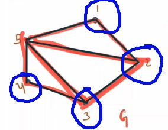
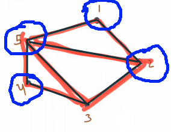
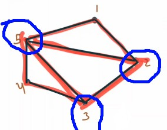
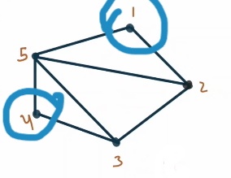
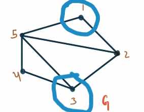
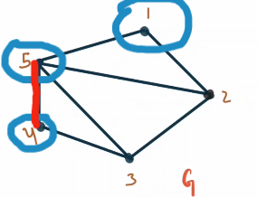
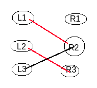
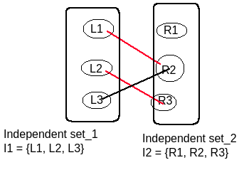
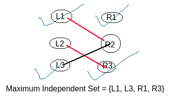

# Vertex Cover:
 

**A vertex cover in a graph is a set of vertices that includes at least one endpoint of every edge.**

In the given graph, consider the vertex set **V_c = {1, 2, 3, 4}**. This set qualifies as a vertex cover because every edge in the graph has at least one endpoint within **V_c**. 
 

 

Similarly, the sets **V_c = \{1, 2, 4, 5\}**, **V_c = \{2, 3, 5\}** and **V_c = \{1, 2, 3, 4, 5\}** also serve as valid vertex covers.
 

 

 

But **V_c = \{1, 2, 5\}** is **not** a vertex cover, because as we can see below, there is an edge which is not covered.

 

  
 
 

**Finding any vertex cover set is a simple task because the set of all vertices always serves as a vertex cover surely. However, the real challenge lies in finding the minimum vertex cover.**

 

## Minimum Vertex Cover:
 

**A vertex cover is minimum if no other vertex cover has fewer vertices. Number of vertices in the minimum vertex cover set is lowest among all the vertex cover sets**

 

For example in the graph, **V_c = \{2, 3, 5\}** is a minimum vertex cover.

 

---

# Independent Set:
 

**An independent set in a graph is a set of vertices such that no edge in the graph connects any pair of vertices in the independent set.**

For example in the graph, vertex set **I = {1, 4}** or **I = {1, 3}** is an independent set. Because no edge in the graph connects any pair of vertices in the independent set **I**. 

 

 

But **Set {1, 4, 5} or {1, 2, 3}** is not an independent set. As we can see, an edge connect the pair of vertices (4, 5) which are in **{1, 4, 5}** and two edges connets the pairs of vertices (1, 2) and (2, 3) which are in **{1, 2, 3**.

 

 
 
 

**Finding any independent set is very easy, as any single vertex set can serve as an independent set. example I = {1} or I = {2} ..**
 
**But the real challenge lies in finding the maximum independent set.**

 
 

## Maximum Independent Set:
 

**An independent set is maximum if no other independent set contains more vertices.**
 
For example in the above graph **I = {1, 4}** is a maximum independent set. or **I = {1, 3}**. 

 
 

**Example for an bipartite graph:**
 

The **left** vertices set or **right** vertices set can be considered an **independent set**. But maximum independent set could be different. 
 

These independent set contains **3** vertices, But below the Maximum Independent set contains **4** vertices......
 

---

# The minimum vertex cover is the exact opposite of the maximum independent set:
 

**In a graph, the vertices in the maximum independent set are precisely those not included in the minimum vertex cover, and vice versa.**

 

For example minimum vertex cover **V_c = {2, 3, 5}** and maximum independent set **I = {1, 4}**.  
They are excatly opposite/complement of each other, ie. **I = {V - V_c} or V_c = {V - I}**.

  

 
 

**For a graph, if we find the minimum vertex cover, we can also determine the maximum independent set by simply taking the complement of the minimum vertex cover.**

 
 

**However, finding the minimum vertex cover or the maximum independent set for any graph is an NP-hard problem.**

 

**However, things become interesting when we consider a bipartite graph.**

 

---

# Kőnig's theorem: In any bipartite graph, the number of edges in a maximum matching |M|, equals the number of vertices in a minimum vertex cover |V_c|.

 
For proof check the example section of : https://en.wikipedia.org/wiki/K%C5%91nig%27s_theorem_(graph_theory)#Example
 
Also check this video : https://www.youtube.com/watch?v=K-g5AzHACWs
 

