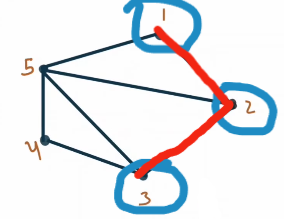

# Vertex Cover:
 

**A vertex cover in a graph is a set of vertices that includes at least one endpoint of every edge.**

In the given graph, consider the vertex set **V_c = {1, 2, 3, 4}**. This set qualifies as a vertex cover because every edge in the graph has at least one endpoint within **V_c**. 
 

 

Similarly, the sets **V_c = \{1, 2, 4, 5\}**, **V_c = \{2, 3, 5\}** and **V_c = \{1, 2, 3, 4, 5\}** also serve as valid vertex covers.
 

 

 

But **V_c = \{1, 2, 5\}** is **not** a vertex cover, because as we can see below, there is an edge which is not covered.

 

  

**Finding any vertex cover set is a simple task because the set of all vertices always serves as a vertex cover surely. However, the real challenge lies in finding the minimum vertex cover.**

## Minimum Vertex Cover:
 

**A vertex cover is minimum if no other vertex cover has fewer vertices. Number of vertices in the minimum vertex cover set is lowest among all the vertex cover sets**

 

For example in the graph, **V_c = \{2, 3, 5\}** is a minimum vertex cover.

 

---

# Independent Set:
 

**An independent set in a graph is a set of vertices such that no edge in the graph connects any pair of vertices in the independent set.**

For example in the graph, vertex set **I = {1, 4}** or **I = {1, 3}** is an independent set. Because no edge in the graph connects any pair of vertices in the independent set **I**. 

 

 

But **Set {1, 4, 5} or {1, 2, 3}** is not an independent set. As we can see, an edge connect the pair of vertices (4, 5) which are in **{1, 4, 5}** and two edges connets the pairs of vertices (1, 2) and (2, 3) which are in **{1, 2, 3**.

 

